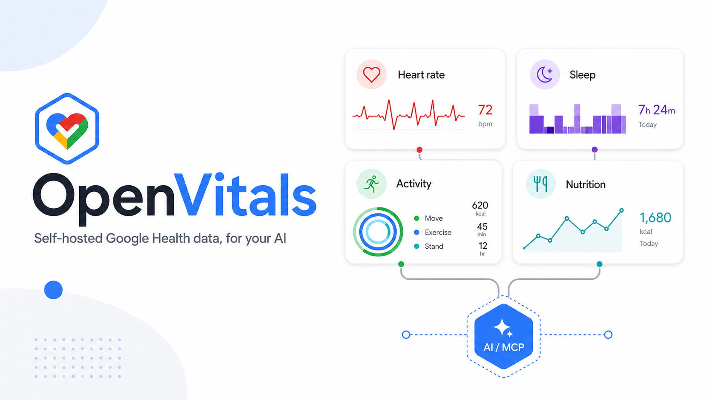

<div align="center">



<h1>OpenVitals</h1>

**Your Google Health data as a self-hosted [MCP](https://modelcontextprotocol.io) server** — so ChatGPT, Claude, or any MCP-capable AI can read your heart, sleep, workouts & nutrition and reason over them. On your hardware. No subscription.


</div>

---

## Because Google's AI is too costly

Google will analyze your health data for you — behind a paid product. As an individual (not a company), you shouldn't need a subscription just to ask *"how did I sleep this week vs. last?"*

|  | Google's paid AI | **OpenVitals** |
|---|---|---|
| **Cost** | Monthly subscription | Free — uses the AI you already have |
| **Your data** | Leaves your device | Stays in a local SQLite file on your box |
| **Secrets** | Enterprise setup | Your own free Google Cloud OAuth client |
| **The AI** | Locked to their product | Any MCP client — Claude, ChatGPT, Cursor… |

You own the Google Cloud project, you hold the OAuth secrets, your data never leaves your machine. The "AI" is whatever MCP client you already pay for (or run free).

---

## ✨ What you get

- 🩺 **~60 MCP tools** over your real Google Health data — heart, sleep, activity, glucose, SpO₂, temperature, ECG, body composition
- 🍎 **Nutrition & workouts** — log meals, search foods, barcode lookup, recipes, workout plans, exercise search
- 📈 **Insights** — daily/weekly summaries, progress, recommendations, plan-vs-logged comparison
- 🔒 **Read-only** Google scopes; every secret stays local and gitignored (the v4 API itself *does* support writes under separate `*.writeonly` scopes — see below)
- 🏠 **Runs anywhere** always-on — an old laptop, a Raspberry Pi, a mini-PC
- 🔌 **Any MCP client** — local (Claude Code, Cursor) or cloud (ChatGPT, Claude apps) via a tunnel

---

## 🔌 How it works

```
Google Health API  ──►  OpenVitals server  ──►  SQLite (your machine)
   (your data)         (always-on device)              │
                                                        ▼
                              your AI client  ◄──  POST /mcp  (bearer token)
                          (Claude · ChatGPT)     localhost, or a public URL
```

Three things you need:

1. **An always-on device.** The server must be running for your AI to reach it and sync fresh data. Anything that stays on. *(This repo runs on a laptop-as-homelab-server.)*
2. **Your own free Google Cloud + Health secrets.** You create a free OAuth client and drop the file in place. OpenVitals uses it to read *your* Google Health with read-only scopes.
3. **(Only for cloud apps) a public URL.** No domain required — a free **ngrok** / Cloudflare / Tailscale tunnel gives you an HTTPS URL in one command.

---

## 🚀 Quickstart

### Prerequisites
- **Node 22+** (uses the built-in `node:sqlite`)
- A Google account with data in Google Health

### 1 — Create your Google Cloud secrets (free)

1. [Google Cloud Console](https://console.cloud.google.com/) → **New project** (free).
2. **APIs & Services → Enable APIs** → enable the **Google Health API**.
3. **OAuth consent screen** → **External** → add your own Google account as a **Test user** (no Google verification needed for personal use).
4. Add these **read-only** scopes (OpenVitals never asks for write access):
   ```
   openid  profile
   googlehealth.activity_and_fitness.readonly
   googlehealth.health_metrics_and_measurements.readonly
   googlehealth.nutrition.readonly
   googlehealth.profile.readonly
   googlehealth.sleep.readonly
   googlehealth.ecg.readonly
   googlehealth.irn.readonly
   googlehealth.location.readonly
   googlehealth.settings.readonly
   ```
5. **Credentials → Create credentials → OAuth client ID → Desktop app**.
6. Add this **Authorized redirect URI**: `http://127.0.0.1:42813/oauth/callback`
7. **Download** the client JSON → save it as `~/.hermes/secrets/google-health-client.json` (or point `GOOGLE_HEALTH_SECRETS` at it).

### 2 — Install & run

```bash
git clone https://github.com/saiteja007-mv/openvitals.git
cd openvitals
npm install
npm run build      # builds the web UI
npm run server     # → http://127.0.0.1:42815
```

### 3 — Connect Google Health (one-time)

Do the OAuth login once to authorize OpenVitals. It stores a **refresh token** in `.data/google-health-credentials.json` and refreshes it automatically forever after. Pull data any time with the `sync_google_health` tool or `POST /api/sync`.

> 💡 If a login is rejected, disconnect any datacenter VPN first — Google blocks OAuth from datacenter exit IPs.

### 4 — Grab your MCP token

```bash
cat .data/mcp-token.txt
```
This bearer token guards `/mcp`. You'll paste it into your AI client below.

---

## 🌐 Make it reachable

**Which clients need a public URL?** It depends on where the client runs:

| Client | Runs… | Endpoint it can reach |
|---|---|---|
| Claude Code, Cursor, Windsurf, Cline | **on your machine** | `http://127.0.0.1:42815/mcp` — **no tunnel needed** |
| Claude app (custom connector), ChatGPT | **in the vendor's cloud** | needs a **public HTTPS URL** ↓ |

> ⚠️ The Claude and ChatGPT apps connect to a custom connector **from Anthropic's / OpenAI's cloud, not your device** — so `localhost` is invisible to them. You need a public URL. You do **not** need to own a domain — any of these gives you a free one:

<details>
<summary><b>ngrok</b> — one command, no domain, no account setup</summary>

```bash
ngrok http 42815
```
Copy the `https://<random>.ngrok-free.app` it prints. Your MCP URL is:
```
https://<random>.ngrok-free.app/mcp?token=<your-token>
```
- The free URL changes on every restart. For a stable one, claim ngrok's **1 free static domain**: `ngrok http --url=your-name.ngrok-free.app 42815`.
- ngrok's free tier shows a browser warning page; MCP clients (non-browser) usually bypass it automatically.
</details>

<details>
<summary><b>Cloudflare Tunnel</b> — free random <code>*.trycloudflare.com</code>, no domain, no account</summary>

```bash
cloudflared tunnel --url http://localhost:42815
```
Use the printed `https://<random>.trycloudflare.com/mcp?token=<your-token>`. If you *do* own a domain, run a named tunnel for a stable `https://health.yourdomain.com`.
</details>

<details>
<summary><b>Tailscale Funnel</b> — stable <code>*.ts.net</code> HTTPS URL</summary>

```bash
tailscale funnel 42815
```
Gives a public `https://<machine>.<tailnet>.ts.net/mcp?token=<your-token>` backed by your Tailscale identity.
</details>

---

## 🤖 Connect your AI app

Two ways to authenticate, both accepted by the server:
- **Header:** `Authorization: Bearer <token>` — for clients with a headers field.
- **URL token:** `…/mcp?token=<token>` — for connector dialogs with **no** header field (ChatGPT, Claude custom connector).

<details open>
<summary><b>Claude Code</b> (local — no tunnel)</summary>

```bash
claude mcp add --transport http openvitals http://127.0.0.1:42815/mcp \
  --header "Authorization: Bearer <token>"
```
</details>

<details>
<summary><b>Claude app</b> (Desktop / claude.ai)</summary>

**Option A — local bridge (reaches localhost, no tunnel).** Edit `claude_desktop_config.json`:
```json
{
  "mcpServers": {
    "openvitals": {
      "command": "npx",
      "args": ["-y", "mcp-remote", "http://127.0.0.1:42815/mcp",
               "--header", "Authorization: Bearer <token>"]
    }
  }
}
```

**Option B — cloud custom connector (needs a public URL from above).**
Settings → **Connectors** → **Add custom connector** → paste
`https://<your-public-host>/mcp?token=<token>` → **Add**.
*(Available on Free/Pro/Max/Team/Enterprise; Free is limited to one custom connector.)*
</details>

<details>
<summary><b>ChatGPT app</b> (needs a public URL)</summary>

1. Settings → **Connectors** → **Advanced** → toggle **Developer mode** on.
2. **Connectors** → **Add custom connector**.
3. Paste your public URL: `https://<your-public-host>/mcp?token=<token>`
4. **Create** → it appears in the ➕ / tools menu of a chat.

> Developer mode with full tools is on **Business/Enterprise/Edu**; **Plus/Pro** get read-only custom connectors. Your server must be HTTPS and public.
</details>

<details>
<summary><b>Cursor</b> (local — no tunnel)</summary>

`.cursor/mcp.json` in your project (or global settings):
```json
{
  "mcpServers": {
    "openvitals": {
      "url": "http://127.0.0.1:42815/mcp",
      "headers": { "Authorization": "Bearer <token>" }
    }
  }
}
```
</details>

<details>
<summary><b>Windsurf · Cline · other MCP clients</b></summary>

Any client that speaks **Streamable HTTP** works. Point it at:
- **URL:** `http://127.0.0.1:42815/mcp` (local) or your public HTTPS URL (cloud)
- **Auth:** `Authorization: Bearer <token>` header, or append `?token=<token>` to the URL

For stdio-only clients, wrap it with `npx -y mcp-remote <url> --header "Authorization: Bearer <token>"`.
</details>

Then just ask: *"summarize my sleep this week"*, *"what's my resting heart rate trend?"*, *"log a 5 km run"*, *"am I hitting my protein target?"*

---

## 🛠 Tools (~70)

| Group | Examples |
|---|---|
| **Google Health** | `get_heart` · `get_sleep` · `get_activity` · `get_glucose` · `get_spo2` · `get_temperature` · `get_breathing` · `get_body_composition` · `sync_google_health` |
| **Summaries** | `get_daily_summary` · `get_weekly_summary` · `get_progress` · `get_recommendation` · `compare_plan_vs_logged` |
| **Exercise sessions** | `list_exercise_sessions` · `get_exercise_session` · `sync_exercise_sessions` · `export_exercise_tcx` · `get_workout_day` |
| **Raw Google Health escape hatch** | `query_google_health` — any of the 42 data types Google Health v4 exposes, by name |
| **Nutrition** | `log_meal` · `search_food` · `lookup_barcode` · `get_nutrition_intake` · `get_food_log` · meal recipes |
| **Workouts** | `log_workout` (optional `session_id` to attach to a Google Health session) · `search_exercises` · workout plans |
| **Body & habits** | `upsert_body_metric` · `list_body_metrics` · habits · reminders · hydration |

See [`docs/google-health-api-v4.md`](docs/google-health-api-v4.md) for the full Google Health v4 API
reference this server is built against (all 27 methods, all 42 data types, filter grammar, roadmap).

### What Google Health does and does not record

Google Health's `Exercise` schema has **no exercise names, sets, reps, or weights**. A strength workout
arrives as `exerciseType: "WORKOUT"` with `displayName` set to the muscle group — `"Back"`, `"Chest"`,
`"Leg"`, `"Arms"`, `"Shoulders"` — plus heart rate, calories, and HR-zone minutes for the session as a
whole. If you want your actual sets logged, use `log_workout` and pass the `session_id` from
`list_exercise_sessions` to attach them — that's the only place sets/reps/exercise names live.

---

## ⚙️ Configuration

All optional — sensible defaults are auto-generated on first run.

| Variable | Default | Purpose |
|---|---|---|
| `PORT` | `42815` | Port the server listens on |
| `GOOGLE_HEALTH_SECRETS` | `~/.hermes/secrets/google-health-client.json` | Your Google OAuth client JSON |
| `HEALTH_MCP_GH_CREDENTIALS` | `.data/google-health-credentials.json` | Stored Google token |
| `HEALTH_MCP_DB` | `.data/health-mcp.sqlite` | SQLite database path |
| `HEALTH_MCP_TOKEN` | auto → `.data/mcp-token.txt` | Bearer token for `/mcp` |
| `HEALTH_MCP_PASSWORD` | auto-generated | Web-UI password |
| `HEALTH_MCP_HEALTH_TTL_MS` | `60000` | Google Health response cache TTL |
| `HEALTH_MCP_NO_AUTH` | unset | Disable auth (**local dev only** — never expose) |

---

## 🔒 Security

- Everything sensitive is **gitignored** — `.data/` (DB, tokens, password, TLS) is never committed.
- Google scopes are **read-only** — this server never requests a `*.writeonly` scope. (The Google Health v4
  API itself has `create`/`patch`/`batchDelete` endpoints for most data types, gated behind those separate
  writeonly scopes; OpenVitals just doesn't ask for them. See [`docs/google-health-api-v4.md`](docs/google-health-api-v4.md).)
- On a public URL, the bearer token is the only thing guarding your data — keep it secret, prefer a tunnel over opening a router port, and rotate it by deleting `.data/mcp-token.txt` and restarting.

## 📄 License

MIT — see [`LICENSE`](LICENSE).

> **Disclaimer:** OpenVitals is a personal project, not a medical device, and is not affiliated with Google. Don't make medical decisions from it.
